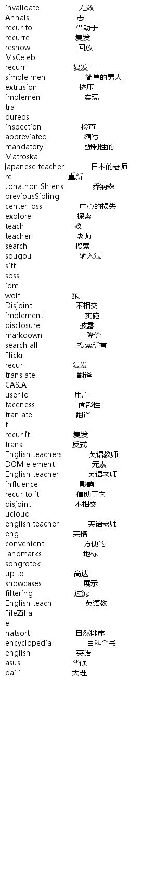

The **parse_chrome.py** file is set to get unknown english words and it's chinese translated result into an image.
 1. Search **_chrome_** browser history to get all searching history
 2. Filter these urls with 2 rules
    * directly search english words with baidu engine
    * search english words in baidu fanyi
 
 **comment**:This function will produce a filtered file words.txt. You can manually change words in the file,
  to pick out wrong words.
  
 3. Set **_WhiteWords.txt_**
    * WhiteWords are those common search words,such as **python**, **english**, **paper**
    
 4. Use baidu's V2transappi to translate unknown words
 
    * not enough accurate, but used for now
    
 5. Change unknown words and it's translated results into an image
 
 ##***How to use***
 
In the command line, input:

``python parse_chrome.py``

 For a example, the final image is as follows:
 
 
 
 
